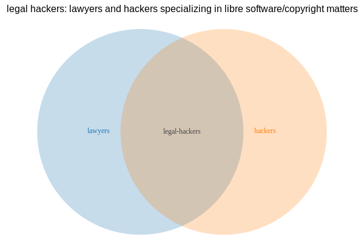

# legal hackers: lawyers and hackers specializing in libre software/copyright matters

## What's this?

People often ask who they should consult for libre/free/open source software
matters, particularly those relating to licensing, copyright and copyleft,
patents, and other intellectual property issues.

What follows is a curated public list of those members so that others can get
access to their services. Hopefully this will improve communication and reduce
FUD, while supporting small businesses and consultancies.

## Can anyone join the list?

To be part of this list, you must have at least seven (7) points from the below
criteria in at least three (3) different categories:

- [ ] (1 pt/year, 3 pts max) active participation in a well-known legal discussion group
- [ ] (1 pt) hold a law degree from a recognized university
- [ ] (2 pt/publication, 2 pts max) publish an intermediate to advanced article about legal issues relevant to this list
- [ ] (1 pt/referral, 2 pts max) receive a recommendation from someone on this list
- [ ] (1 pt) demonstrate basic proficiency using the `git` tool
- [ ] (2 pts) demonstrate basic proficiency using the `gpg` tool with email

The criteria and categories are subject to change. Feel free to propose a patch!
Individuals must consent to being added to this list, and as a result they
should submit the patch on their own behalf.

## The list:

[The full list of individuals is available here.](individuals.md)

## How to:

Issue a pull request:

- edit the `/individuals.md` file (adding your own entry, in alphabetical order)
- add a file in `/individuals/` (use [individuals/template.md](individuals/template.md))
- your commit comment should follow the following standard: `individual: Add Newname`
(prefix lowercase, colon, the rest capitalized)
- include a self-evaluation checklist in the extended comment, using the template in
[.github/PULL_REQUEST_TEMPLATE.md](.github/PULL_REQUEST_TEMPLATE.md)
- never use trailing spaces (indentation using tabs only)
- wait for the result of the automated tests; should your submission fail, look at
the bottom of the log to see what's wrong
- wait for your submission to be approved, fix the warnings you have received

## Questions:

Please ask on [IRC](https://webchat.freenode.net/?channels=#legal-hackers)!
If you have a well phrased question that might benefit others, consider asking
it by sending a patch to the [FAQ](faq.md) section. I'll merge your
question, and a patch with the answer!

## Maintainer:

This list is being maintained by [@purpleidea](https://twitter.com/purpleidea).
They have final say over any issues.

Happy legal hacking!
